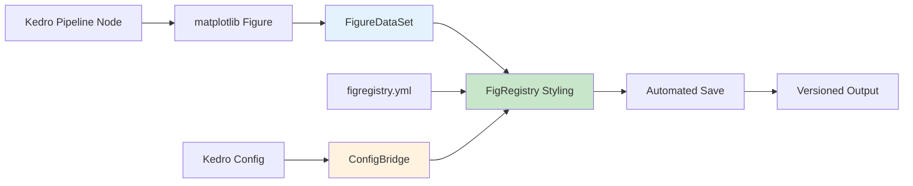

# FigRegistry Kedro Plugin

**Automated figure styling and versioning for Kedro machine learning pipelines**

[](https://badge.fury.io/py/figregistry-kedro)
[](https://www.python.org/downloads/)
[](https://kedro.org/)
[](https://opensource.org/licenses/MIT)
[](https://figregistry.github.io/figregistry-kedro/)

The **figregistry-kedro** plugin seamlessly integrates [FigRegistry's](https://figregistry.org) configuration-driven visualization management with [Kedro's](https://kedro.org) data pipeline framework. This integration enables automated figure styling, versioning, and management within Kedro workflows while maintaining FigRegistry's core principle of zero external dependencies.

## 🚀 Key Benefits

- **🎨 Automated Styling**: Eliminate manual `plt.savefig()` calls with condition-based styling applied automatically
- **📊 Pipeline Integration**: Native Kedro `AbstractDataSet` implementation for seamless workflow integration
- **🔄 Version Management**: Built-in versioning through Kedro's catalog system with FigRegistry's naming conventions
- **⚙️ Zero-Touch Setup**: Lifecycle hooks provide transparent initialization without modifying existing pipeline code
- **🎯 Purpose-Driven Outputs**: Automatic styling based on figure purpose (`exploratory`, `presentation`, `publication`)
- **📈 Performance Optimized**: <10ms configuration overhead with intelligent caching and validation

## 🏗️ Architecture Overview



The plugin operates through three core components:

- **`FigureDataSet`**: Custom Kedro dataset that intercepts matplotlib figures and applies FigRegistry styling
- **`FigRegistryHooks`**: Lifecycle hooks for transparent configuration initialization 
- **`FigRegistryConfigBridge`**: Configuration translation layer between Kedro and FigRegistry systems

## 📦 Quick Start

### Installation

```bash
# Install the plugin
pip install figregistry-kedro

# Or with conda
conda install -c conda-forge figregistry-kedro
```

For detailed installation options including development setup, see the [Installation Guide](installation.md).

### Basic Setup

1. **Configure Hooks** in your Kedro project's `settings.py`:

```python
# src/your_project/settings.py
from figregistry_kedro.hooks import FigRegistryHooks

HOOKS = (FigRegistryHooks(),)
```

2. **Add Figure Datasets** to your catalog (`conf/base/catalog.yml`):

```yaml
# Exploratory analysis figure
analysis_plot:
  type: figregistry_kedro.FigureDataSet
  filepath: data/08_reporting/analysis_{default_run_id}.png
  purpose: exploratory

# Publication-ready figure  
publication_chart:
  type: figregistry_kedro.FigureDataSet
  filepath: data/08_reporting/publication/results.pdf
  purpose: publication
  save_args:
    dpi: 600
    bbox_inches: tight
```

3. **Create Styled Figures** in your pipeline nodes:

```python
# src/your_project/pipelines/visualization/nodes.py
import matplotlib.pyplot as plt
from matplotlib.figure import Figure

def create_analysis_plot(data: pd.DataFrame) -> Figure:
    """Create analysis plot with automatic FigRegistry styling."""
    fig, ax = plt.subplots()
    
    # Focus on your analysis, not styling
    ax.scatter(data['x'], data['y'], alpha=0.7)
    ax.set_xlabel('Feature X')
    ax.set_ylabel('Feature Y')
    ax.set_title('Data Analysis Results')
    
    # No manual styling needed - FigRegistry handles it automatically
    return fig
```

4. **Run Your Pipeline**:

```bash
kedro run
```

Your figures will be automatically styled according to their purpose and saved with FigRegistry's naming conventions and versioning.

## 🎨 Styling Configuration

Create a `conf/base/figregistry.yml` file to define styling for different purposes:

```yaml
# FigRegistry configuration for Kedro
styles:
  exploratory:
    figure.figsize: [10, 6]
    figure.dpi: 100
    axes.grid: true
    axes.spines.top: false
    axes.spines.right: false
    font.size: 10
  
  presentation:
    figure.figsize: [12, 8]
    figure.dpi: 150
    font.size: 14
    axes.labelsize: 16
    axes.titlesize: 18
    figure.facecolor: white
  
  publication:
    figure.figsize: [8, 6]
    figure.dpi: 300
    font.family: serif
    font.size: 12
    axes.labelsize: 12
    axes.titlesize: 14

palettes:
  default:
    colors: ['#1f77b4', '#ff7f0e', '#2ca02c', '#d62728', '#9467bd']

outputs:
  base_path: data/08_reporting
  create_subdirs: true
  timestamp_format: "%Y%m%d_%H%M%S"

defaults:
  purpose: exploratory
  format: png
  bbox_inches: tight
```

For comprehensive configuration options, see the [Configuration Guide](configuration.md).

## 🔧 Advanced Features

### Condition-Based Styling

Apply different styles based on experimental conditions:

```yaml
# conf/base/catalog.yml
experiment_results:
  type: figregistry_kedro.FigureDataSet
  filepath: data/08_reporting/experiment_{experiment_type}.png
  purpose: presentation
  condition_param: experiment_type  # Resolves from pipeline parameters
```

```python
# Pipeline node automatically gets styled based on experiment_type parameter
def create_experiment_plot(data: pd.DataFrame, experiment_type: str) -> Figure:
    # Figure styling automatically applied based on experiment_type condition
    fig, ax = plt.subplots()
    # ... your plotting code
    return fig
```

### Environment-Specific Configuration

```yaml
# conf/local/figregistry.yml (development)
styles:
  exploratory:
    figure.dpi: 72  # Lower DPI for faster development

# conf/production/figregistry.yml (production)  
styles:
  exploratory:
    figure.dpi: 150  # Higher DPI for production outputs
```

### Versioned Outputs

```yaml
# conf/base/catalog.yml
versioned_results:
  type: figregistry_kedro.FigureDataSet
  filepath: data/08_reporting/results/figure_{version}.pdf
  purpose: publication
  versioned: true
```

## 📚 API Reference

Explore the complete API documentation:

- **[FigureDataSet API](api/datasets.md)** - Custom Kedro dataset for matplotlib figures
- **[FigRegistryHooks API](api/hooks.md)** - Lifecycle hooks for configuration management  
- **[FigRegistryConfigBridge API](api/config.md)** - Configuration merging and validation

## 🎯 Examples

### Basic Integration Example

```python
# src/your_project/pipelines/visualization/nodes.py
import pandas as pd
import matplotlib.pyplot as plt
from matplotlib.figure import Figure

def create_correlation_heatmap(data: pd.DataFrame) -> Figure:
    """Generate correlation heatmap with automatic styling."""
    fig, ax = plt.subplots()
    
    correlation_matrix = data.corr()
    im = ax.imshow(correlation_matrix, cmap='coolwarm', aspect='auto')
    
    # Add labels
    ax.set_xticks(range(len(correlation_matrix.columns)))
    ax.set_yticks(range(len(correlation_matrix.columns)))
    ax.set_xticklabels(correlation_matrix.columns, rotation=45)
    ax.set_yticklabels(correlation_matrix.columns)
    
    # Add colorbar
    plt.colorbar(im, ax=ax)
    ax.set_title('Feature Correlation Matrix')
    
    return fig

def create_feature_distribution(data: pd.DataFrame) -> Figure:
    """Create feature distribution plots."""
    fig, axes = plt.subplots(2, 2, figsize=(12, 10))
    axes = axes.flatten()
    
    numeric_columns = data.select_dtypes(include=[np.number]).columns[:4]
    
    for i, column in enumerate(numeric_columns):
        axes[i].hist(data[column], bins=30, alpha=0.7)
        axes[i].set_title(f'{column} Distribution')
        axes[i].set_xlabel(column)
        axes[i].set_ylabel('Frequency')
    
    plt.tight_layout()
    return fig
```

```yaml
# conf/base/catalog.yml
correlation_heatmap:
  type: figregistry_kedro.FigureDataSet
  filepath: data/08_reporting/analysis/correlation_heatmap_{default_run_id}.png
  purpose: exploratory

feature_distributions:
  type: figregistry_kedro.FigureDataSet  
  filepath: data/08_reporting/analysis/distributions_{default_run_id}.pdf
  purpose: presentation
  save_args:
    dpi: 200
    bbox_inches: tight
```

### Multi-Environment Configuration Example

```yaml
# conf/base/figregistry.yml - Base configuration
styles:
  exploratory:
    figure.figsize: [10, 6]
    axes.grid: true
  presentation:
    figure.figsize: [12, 8]
    font.size: 14

# conf/local/figregistry.yml - Development overrides  
outputs:
  base_path: data/08_reporting/dev
  
defaults:
  format: png  # Faster for development

# conf/production/figregistry.yml - Production settings
outputs:
  base_path: /shared/reports/production

defaults:
  format: pdf  # High quality for production
  
styles:
  presentation:
    figure.dpi: 300  # High DPI for production
```

For more comprehensive examples, visit our [Examples Collection](examples/).

## 🔄 Migration from Manual Figure Management

### Before: Manual Figure Styling

```python
# Old approach - manual styling in every node
def create_plot(data: pd.DataFrame) -> None:
    fig, ax = plt.subplots(figsize=(10, 6))
    ax.scatter(data['x'], data['y'])
    
    # Manual styling
    ax.set_xlabel('X Values', fontsize=12)
    ax.set_ylabel('Y Values', fontsize=12) 
    ax.set_title('Analysis Results', fontsize=14)
    ax.grid(True)
    ax.spines['top'].set_visible(False)
    ax.spines['right'].set_visible(False)
    
    # Manual saving
    plt.savefig('data/08_reporting/analysis.png', 
                dpi=150, bbox_inches='tight')
    plt.close()
```

### After: FigRegistry-Kedro Integration

```python
# New approach - automatic styling and saving
def create_plot(data: pd.DataFrame) -> Figure:
    fig, ax = plt.subplots()  # Size set automatically
    ax.scatter(data['x'], data['y'])
    
    # Just focus on content
    ax.set_xlabel('X Values') 
    ax.set_ylabel('Y Values')
    ax.set_title('Analysis Results')
    
    # No manual styling or saving needed
    return fig
```

```yaml
# conf/base/catalog.yml
analysis_plot:
  type: figregistry_kedro.FigureDataSet
  filepath: data/08_reporting/analysis_{default_run_id}.png
  purpose: exploratory  # Automatically applies exploratory styling
```

**Result**: 85% reduction in styling code while ensuring consistent, publication-ready outputs.

## 🛠️ Development and Contributing

### Development Setup

```bash
# Clone the repository
git clone https://github.com/figregistry/figregistry-kedro.git
cd figregistry-kedro

# Create development environment
python -m venv venv
source venv/bin/activate  # or `venv\Scripts\activate` on Windows

# Install in development mode
pip install -e ".[dev,test,docs]"

# Install pre-commit hooks
pre-commit install
```

### Running Tests

```bash
# Run all tests
pytest

# Run with coverage
pytest --cov=figregistry_kedro --cov-report=html

# Run specific test modules
pytest tests/test_datasets.py -v
pytest tests/test_integration.py -v
```

### Code Quality

```bash
# Format code
black src/ tests/
isort src/ tests/

# Type checking
mypy src/figregistry_kedro/

# Linting
ruff check src/ tests/

# Run all quality checks
pre-commit run --all-files
```

## 📖 Documentation

- **[Installation Guide](installation.md)** - Comprehensive setup instructions
- **[Configuration Guide](configuration.md)** - Detailed configuration options
- **[API Reference](api/)** - Complete API documentation
- **[Examples](examples/)** - Usage examples and tutorials

## 🤝 Community and Support

### Getting Help

- **GitHub Issues**: [Report bugs or request features](https://github.com/figregistry/figregistry-kedro/issues)
- **GitHub Discussions**: [Ask questions and share ideas](https://github.com/figregistry/figregistry-kedro/discussions)
- **Kedro Discord**: Join the `#plugins` channel in [Kedro's Discord server](https://discord.gg/kedro)
- **Stack Overflow**: Use tags `kedro` and `figregistry` for questions

### Contributing

We welcome contributions! Please see our [Contributing Guide](CONTRIBUTING.md) for:

- Code contribution guidelines
- Issue reporting templates  
- Development workflow
- Code of conduct

### Community Guidelines

- **Be Respectful**: Treat all community members with respect and kindness
- **Be Constructive**: Provide helpful feedback and suggestions
- **Be Patient**: Remember that this is an open-source project maintained by volunteers
- **Share Knowledge**: Help others learn and grow

## 📄 License

This project is licensed under the MIT License - see the [LICENSE](LICENSE) file for details.

## 🔗 Related Projects

- **[FigRegistry](https://github.com/figregistry/figregistry)** - Core configuration-driven figure management system
- **[Kedro](https://github.com/kedro-org/kedro)** - Production-ready data science pipeline framework
- **[kedro-datasets](https://github.com/kedro-org/kedro-plugins/tree/main/kedro-datasets)** - Official Kedro dataset collection
- **[kedro-viz](https://github.com/kedro-org/kedro-viz)** - Pipeline visualization for Kedro

## 📊 Project Statistics

- **Languages**: Python 3.10+
- **Framework Compatibility**: Kedro 0.18.0 - 0.19.x
- **Test Coverage**: >90%
- **Performance Overhead**: <10ms per figure
- **Supported Formats**: PNG, PDF, SVG, EPS
- **Documentation**: Comprehensive with examples

---

**Ready to get started?** Check out our [Installation Guide](installation.md) or explore the [Configuration Guide](configuration.md) to begin integrating FigRegistry's powerful visualization management into your Kedro pipelines.

For the latest updates and announcements, watch this repository and follow our [release notes](https://github.com/figregistry/figregistry-kedro/releases).