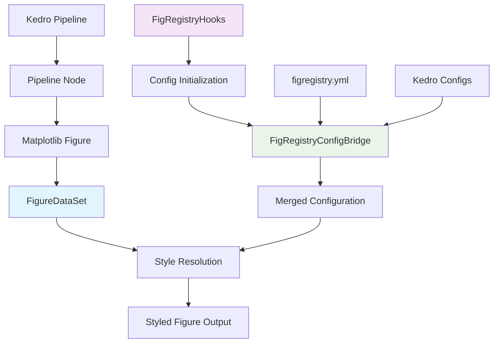

# FigRegistry Kedro Plugin

**Automated figure styling and versioning for Kedro machine learning pipelines**

[](https://badge.fury.io/py/figregistry-kedro)
[](https://www.python.org/downloads/)
[](https://kedro.org/)
[](https://opensource.org/licenses/MIT)
[](https://github.com/figregistry/figregistry-kedro/actions)

## Overview

The `figregistry-kedro` plugin extends [FigRegistry's](https://github.com/figregistry/figregistry) scientific visualization management capabilities into [Kedro](https://kedro.org/) machine learning pipeline frameworks. This integration enables automated figure styling, versioning, and management within Kedro data science workflows while maintaining FigRegistry's core principle of zero external dependencies.

### Key Benefits

🎨 **Automated Styling**: Apply condition-based styles to matplotlib figures automatically during pipeline execution  
📊 **Pipeline Integration**: Seamless integration with Kedro's catalog-based data pipeline architecture  
🔧 **Zero Configuration Overhead**: Leverage existing FigRegistry configurations within Kedro projects  
📈 **Version Management**: Integrated figure versioning through Kedro's built-in catalog versioning  
🚀 **Performance Optimized**: <5% overhead compared to manual figure saving operations  
🔌 **Plugin Architecture**: Clean separation maintaining both systems' architectural philosophies  

### What's Included

- **[FigureDataSet](api/datasets.md)**: Custom Kedro `AbstractDataSet` for matplotlib figure management
- **[FigRegistryHooks](api/hooks.md)**: Lifecycle hooks for non-invasive framework integration  
- **[FigRegistryConfigBridge](api/config.md)**: Configuration bridge for unified YAML management
- **Plugin Infrastructure**: Complete packaging and distribution with CI/CD pipelines

## Quick Start

### Installation

Install the plugin using pip or conda:

```bash
# PyPI installation (recommended)
pip install figregistry-kedro

# Conda installation
conda install -c conda-forge figregistry-kedro
```

For detailed installation instructions including development setup, see the [Installation Guide](installation.md).

### Basic Usage

#### 1. Configure Your Kedro Project

Add FigRegistry configuration to your Kedro project:

```yaml
# conf/base/figregistry.yml
figregistry_version: ">=0.3.0"

condition_styles:
  training:
    color: "#2E86AB"
    marker: "o"
    linestyle: "-"
  
  validation:
    color: "#A23B72"
    marker: "s"
    linestyle: "--"
  
  test:
    color: "#F18F01"
    marker: "^"
    linestyle: ":"

paths:
  base_dir: "data/08_reporting"

kedro:
  dataset_defaults:
    purpose: "expl"
    dpi: 300
    format: "png"
```

#### 2. Register Lifecycle Hooks

Enable FigRegistry integration by registering hooks in your project settings:

```python
# src/your_project/settings.py
from figregistry_kedro.hooks import FigRegistryHooks

HOOKS = (FigRegistryHooks(),)
```

#### 3. Update Data Catalog

Configure figure outputs using `FigureDataSet` in your catalog:

```yaml
# conf/base/catalog.yml
model_performance_plot:
  type: figregistry_kedro.datasets.FigureDataSet
  filepath: data/08_reporting/model_performance.png
  purpose: expl
  condition_param: "model_type"
  versioned: true

training_history_plot:
  type: figregistry_kedro.datasets.FigureDataSet
  filepath: data/08_reporting/training_history.pdf
  purpose: pub
  condition_param: "experiment_id"
  style_params:
    dpi: 300
    bbox_inches: "tight"
```

#### 4. Create Pipeline Nodes

Modify your pipeline nodes to return matplotlib figures instead of saving them manually:

```python
# Before: Manual figure management
def create_model_plot(model_results):
    fig, ax = plt.subplots()
    ax.plot(model_results['epochs'], model_results['accuracy'])
    ax.set_title('Model Accuracy')
    plt.savefig('output/accuracy.png')  # Remove manual saving
    plt.close()
    return None

# After: Return figure for automatic management
def create_model_plot(model_results):
    fig, ax = plt.subplots()
    ax.plot(model_results['epochs'], model_results['accuracy'])
    ax.set_title('Model Accuracy')
    return fig  # FigureDataSet handles styling and saving
```

#### 5. Run Your Pipeline

Execute your pipeline to see automatic figure styling and management:

```bash
kedro run

# Output shows automatic styling application:
# INFO - Applying style 'training' to figure model_performance_plot
# INFO - Saved figure: data/08_reporting/model_performance_20240603_143021.png
```

### Advanced Configuration Example

For more complex scenarios with environment-specific styling and multiple purposes:

```yaml
# conf/base/figregistry.yml
figregistry_version: ">=0.3.0"

condition_styles:
  # Model types
  "neural_network":
    color: "#FF6B6B"
    marker: "o"
    alpha: 0.8
  
  "random_forest":
    color: "#4ECDC4"
    marker: "s"
    alpha: 0.8
  
  "gradient_boosting":
    color: "#45B7D1"
    marker: "^"
    alpha: 0.8
  
  # Experiment phases
  "phase_1":
    linestyle: "-"
    linewidth: 2
  
  "phase_2":
    linestyle: "--"
    linewidth: 2

# Purpose-specific configurations
purpose_styles:
  expl:
    figure_size: [10, 6]
    dpi: 150
    style: "seaborn-v0_8"
  
  pres:
    figure_size: [12, 8]
    dpi: 200
    style: "classic"
    
  pub:
    figure_size: [8, 6]
    dpi: 300
    style: "seaborn-v0_8-paper"

# Advanced path configuration
paths:
  base_dir: "data/08_reporting"
  aliases:
    expl: "exploratory"
    pres: "presentation"
    pub: "publication"

# Kedro-specific settings
kedro:
  dataset_defaults:
    purpose: "expl"
    dpi: 200
    format: "png"
  
  hooks:
    auto_init: true
    log_operations: true
    cache_styles: true
```

For comprehensive configuration options, see the [Configuration Guide](configuration.md).

## Core Features

### FigureDataSet Integration (F-005)

The `FigureDataSet` provides seamless integration between matplotlib figures and FigRegistry's styling system:

- **Automatic Style Application**: Applies condition-based styles during catalog save operations
- **Kedro Versioning Support**: Integrates with Kedro's built-in dataset versioning capabilities
- **Parameter Resolution**: Resolves styling parameters from pipeline context and configuration
- **Format Flexibility**: Supports all matplotlib-compatible output formats (PNG, PDF, SVG, etc.)

```python
from figregistry_kedro.datasets import FigureDataSet

# Programmatic dataset usage
dataset = FigureDataSet(
    filepath="data/08_reporting/analysis.png",
    purpose="expl",
    condition_param="experiment_type",
    style_params={"dpi": 300, "bbox_inches": "tight"}
)

# Save with automatic styling
dataset.save(your_matplotlib_figure)
```

See the [FigureDataSet API Documentation](api/datasets.md) for complete usage details.

### Lifecycle Hooks Integration (F-006)

The `FigRegistryHooks` provide non-invasive integration with Kedro's execution lifecycle:

- **Configuration Initialization**: Automatically initializes FigRegistry during pipeline startup
- **Context Management**: Manages configuration context throughout pipeline execution
- **Thread Safety**: Supports parallel pipeline execution with proper context isolation
- **Error Handling**: Graceful fallback behavior when FigRegistry is unavailable

```python
from figregistry_kedro.hooks import FigRegistryHooks

# Hook registration with custom options
hooks = FigRegistryHooks(
    auto_init=True,
    cache_config=True,
    log_operations=True
)
```

See the [FigRegistryHooks API Documentation](api/hooks.md) for configuration options.

### Configuration Bridge (F-007)

The `FigRegistryConfigBridge` enables unified configuration management across both systems:

- **YAML Merging**: Seamlessly merges Kedro and FigRegistry configuration files
- **Environment Support**: Respects Kedro's environment-specific configuration patterns
- **Precedence Rules**: Clear configuration precedence for conflict resolution
- **Validation**: Pydantic-based validation for type safety and error detection

```python
from figregistry_kedro.config import FigRegistryConfigBridge

# Manual configuration bridge usage
bridge = FigRegistryConfigBridge(kedro_config_loader)
merged_config = bridge.get_merged_config(environment="local")
```

See the [FigRegistryConfigBridge API Documentation](api/config.md) for implementation details.

## Documentation Structure

This documentation is organized into several sections for different user needs:

### 📖 User Guides

- **[Installation Guide](installation.md)**: Comprehensive installation instructions for all environments
- **[Configuration Guide](configuration.md)**: Complete configuration reference and examples
- **[Examples](examples.md)**: Real-world usage examples and migration guides

### 🔧 API Reference

- **[Datasets API](api/datasets.md)**: `FigureDataSet` class documentation and usage patterns
- **[Hooks API](api/hooks.md)**: `FigRegistryHooks` lifecycle integration and configuration
- **[Config API](api/config.md)**: `FigRegistryConfigBridge` configuration merging and validation

### 🚀 Getting Started

New to figregistry-kedro? Follow this learning path:

1. **Read the [Overview](#overview)** to understand the plugin's purpose and benefits
2. **Complete the [Quick Start](#quick-start)** to get a basic implementation running
3. **Review the [Installation Guide](installation.md)** for your specific environment
4. **Study the [Configuration Guide](configuration.md)** to customize styling and behavior
5. **Explore the [Examples](examples.md)** to see real-world implementation patterns

## System Requirements

### Framework Compatibility

| Framework | Required Version | Tested Versions | Notes |
|-----------|------------------|-----------------|-------|
| **Python** | >=3.10 | 3.10, 3.11, 3.12 | Full feature support |
| **FigRegistry** | >=0.3.0 | 0.3.0+ | Core visualization management |
| **Kedro** | >=0.18.0,<0.20.0 | 0.18.0-0.19.x | Pipeline orchestration |
| **Matplotlib** | >=3.9.0 | 3.9.0+ | Visualization backend |

### Platform Support

- **Operating Systems**: Windows 10+, macOS 10.15+, Linux (Ubuntu 20.04+)
- **Container Environments**: Docker, Podman with matplotlib backend configuration
- **Cloud Platforms**: AWS, GCP, Azure with standard Python environments

For detailed compatibility information, see the [Installation Guide](installation.md#system-requirements).

## Performance Characteristics

The figregistry-kedro plugin is designed for minimal performance impact:

- **Overhead**: <5% compared to manual `plt.savefig()` operations
- **Memory Usage**: Efficient figure handling with automatic cleanup
- **Initialization**: Configuration loading <100ms for typical projects
- **Scalability**: Tested with pipelines containing 100+ figure outputs

Performance benchmarks and optimization guidelines are available in the [Configuration Guide](configuration.md#performance-optimization).

## Architecture Overview

The plugin implements a clean separation between Kedro and FigRegistry concerns:



### Design Principles

1. **Zero External Dependencies**: Maintains FigRegistry's philosophy while adding Kedro integration
2. **Non-Invasive Integration**: No modifications required to existing Kedro or FigRegistry components
3. **Configuration Driven**: All behavior controlled through declarative YAML configuration
4. **Plugin Architecture**: Clean separation enabling independent versioning and releases
5. **Backward Compatibility**: Seamless integration with existing Kedro projects and FigRegistry configurations

## Migration Guide

### From Manual Figure Management

If your Kedro project currently uses manual `plt.savefig()` calls:

1. **Install the plugin**: `pip install figregistry-kedro`
2. **Register hooks**: Add `FigRegistryHooks()` to your `settings.py`
3. **Create configuration**: Add `conf/base/figregistry.yml` with your styling preferences
4. **Update catalog**: Replace output datasets with `FigureDataSet` entries
5. **Modify nodes**: Return figures instead of saving them manually
6. **Test migration**: Run your pipeline to verify automatic styling

For step-by-step migration instructions with examples, see the [Migration Guide](examples.md#migration-examples).

### From Standalone FigRegistry

If you're already using FigRegistry outside of Kedro:

1. **Install the plugin**: `pip install figregistry-kedro`
2. **Copy configuration**: Move your existing `figregistry.yaml` to `conf/base/figregistry.yml`
3. **Register hooks**: Enable lifecycle integration in `settings.py`
4. **Configure catalog**: Add `FigureDataSet` entries for pipeline outputs
5. **Update imports**: Change from direct FigRegistry API calls to returning figures

Your existing styling configurations will work seamlessly with the plugin.

## Community and Support

### Getting Help

- **Documentation**: Complete guides and API reference available in this documentation
- **GitHub Issues**: Report bugs and request features at [figregistry/figregistry-kedro](https://github.com/figregistry/figregistry-kedro/issues)
- **Discussions**: Join community discussions and get help from other users
- **Kedro Plugin Registry**: Official listing in Kedro's plugin ecosystem

### Contributing

The figregistry-kedro plugin welcomes contributions from the community:

- **Bug Reports**: Help improve the plugin by reporting issues with detailed reproduction steps
- **Feature Requests**: Suggest new capabilities that would benefit the machine learning community
- **Documentation**: Improve guides, fix typos, and add examples
- **Code Contributions**: Submit pull requests for bug fixes and new features

See the [Contributing Guide](https://github.com/figregistry/figregistry-kedro/blob/main/CONTRIBUTING.md) for development setup and guidelines.

### Acknowledgments

This plugin builds upon the excellent work of:

- **[FigRegistry](https://github.com/figregistry/figregistry)**: Core visualization management system
- **[Kedro](https://kedro.org/)**: Modern pipeline development framework
- **[Matplotlib](https://matplotlib.org/)**: Foundational plotting library
- **[Pydantic](https://pydantic.dev/)**: Configuration validation and type safety

## Roadmap

### Current Release (v0.1.x)

- ✅ Core FigureDataSet implementation
- ✅ Lifecycle hooks integration
- ✅ Configuration bridge
- ✅ Complete documentation
- ✅ CI/CD pipeline and testing

### Upcoming Features (v0.2.x)

- 🔄 **Kedro-Viz Integration**: Visual pipeline representation with figure previews
- 🔄 **MLflow Connectivity**: Experiment tracking integration for figure versioning
- 🔄 **Notebook Support**: Jupyter notebook figure management and tracking
- 🔄 **Performance Optimizations**: Enhanced caching and batch operations

### Future Enhancements (v0.3.x+)

- 📋 **Plugin Templates**: Kedro project starters with FigRegistry integration
- 📋 **Advanced Styling**: CSS-like styling definitions and inheritance
- 📋 **Cloud Storage**: Direct integration with cloud storage backends
- 📋 **Interactive Figures**: Support for interactive visualization libraries

Vote on features and track development progress in our [GitHub Discussions](https://github.com/figregistry/figregistry-kedro/discussions).

## License

This project is licensed under the MIT License - see the [LICENSE](https://github.com/figregistry/figregistry-kedro/blob/main/LICENSE) file for details.

## Citation

If you use figregistry-kedro in your research or projects, please cite:

```bibtex
@software{figregistry_kedro,
  title = {figregistry-kedro: Automated Figure Management for Kedro Pipelines},
  author = {FigRegistry Development Team},
  url = {https://github.com/figregistry/figregistry-kedro},
  version = {0.1.0},
  year = {2024}
}
```

---

**Ready to get started?** Follow the [Quick Start](#quick-start) guide above or dive into the [Installation Guide](installation.md) for your specific environment.

For questions, feedback, or contributions, visit our [GitHub repository](https://github.com/figregistry/figregistry-kedro) or join the [Kedro community](https://kedro.org/community/).