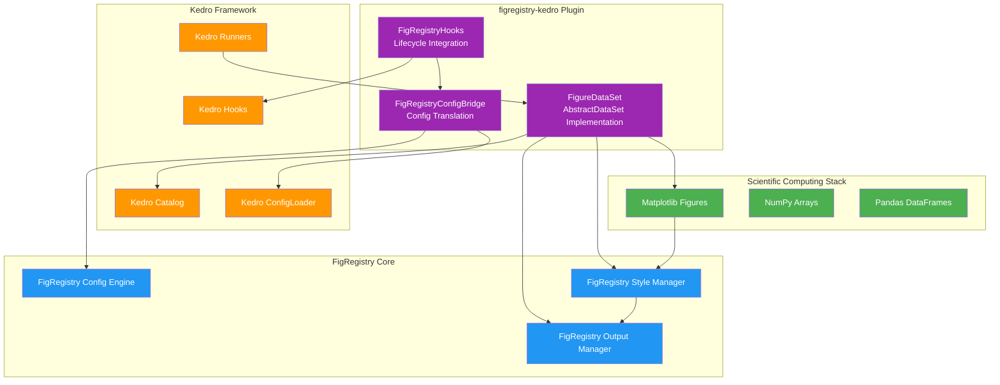
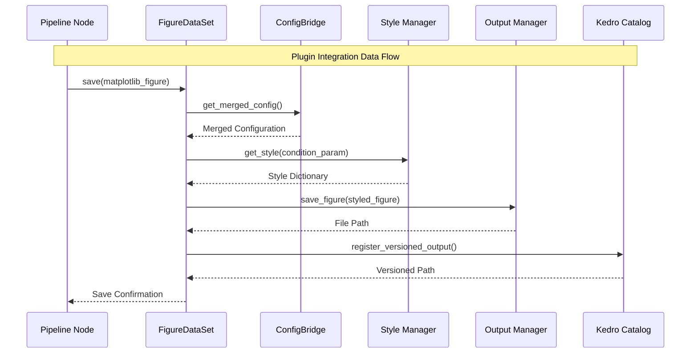

# FigRegistry-Kedro Plugin API Reference

Welcome to the comprehensive API reference for the `figregistry-kedro` plugin. This documentation provides complete coverage of all public interfaces, integration patterns, and architectural components that enable automated figure styling and versioning within Kedro machine learning pipelines.

## Overview

The `figregistry-kedro` plugin extends FigRegistry's scientific visualization management capabilities into the Kedro framework through three core integration components that maintain the architectural philosophies of both systems while enabling powerful workflow automation.

### Plugin Components

| Component | Purpose | API Documentation |
|-----------|---------|-------------------|
| **[FigureDataSet](datasets.md)** | Custom Kedro AbstractDataSet for automated figure styling and versioning | [View API →](datasets.md) |
| **[FigRegistryHooks](hooks.md)** | Lifecycle hooks for non-invasive configuration initialization | [View API →](hooks.md) |
| **[FigRegistryConfigBridge](config.md)** | Configuration translation layer between Kedro and FigRegistry | [View API →](config.md) |

### Key Integration Features

- **Zero-Touch Automation**: Eliminates manual `plt.savefig()` calls and styling code from pipeline nodes
- **Condition-Based Styling**: Automatically applies FigRegistry styling based on experimental conditions
- **Framework Compatibility**: Preserves both Kedro's catalog system and FigRegistry's zero-dependency philosophy
- **Performance Optimized**: <5% overhead compared to manual matplotlib operations
- **Thread-Safe**: Supports parallel execution with Kedro's concurrent runners

## Architecture Overview

The plugin architecture establishes a unidirectional dependency where `figregistry-kedro` depends on both core systems while neither requires awareness of the integration layer.



### Component Data Flow

The integration follows Kedro's pipeline execution model with FigRegistry styling applied at dataset save boundaries:



## Quick Reference

### Installation

```bash
# Install via pip
pip install figregistry-kedro

# Install via conda  
conda install -c conda-forge figregistry-kedro
```

### Basic Usage

#### 1. Register Hooks

```python
# settings.py
from figregistry_kedro.hooks import FigRegistryHooks

HOOKS = (FigRegistryHooks(),)
```

#### 2. Configure Dataset

```yaml
# conf/base/catalog.yml
analysis_plot:
  type: figregistry_kedro.FigureDataSet
  filepath: data/08_reporting/analysis.png
  purpose: presentation
  condition_param: experiment_type
  
training_curves:
  type: figregistry_kedro.FigureDataSet
  filepath: data/08_reporting/training_${experiment_id}.pdf
  purpose: publication
  condition_param: model_architecture
  style_params:
    figure.dpi: 300
    savefig.format: pdf
```

#### 3. Create Pipeline Node

```python
# pipelines/visualization.py
import matplotlib.pyplot as plt
from kedro.pipeline import Pipeline, node

def create_analysis_plot(processed_data, experiment_type):
    """Generate analysis visualization with automatic styling."""
    fig, ax = plt.subplots(figsize=(10, 6))
    
    # Create your visualization
    ax.plot(processed_data['x'], processed_data['y'])
    ax.set_title('Analysis Results')
    ax.set_xlabel('Time')
    ax.set_ylabel('Value')
    
    # Return figure - FigureDataSet handles styling and saving
    return fig

def create_pipeline():
    return Pipeline([
        node(
            func=create_analysis_plot,
            inputs=["processed_data", "params:experiment_type"],
            outputs="analysis_plot",
            name="create_analysis_visualization"
        )
    ])
```

#### 4. Configuration Integration

```yaml
# conf/base/figregistry.yml
purposes:
  exploratory:
    style_params:
      figure.figsize: [8, 6]
      axes.titlesize: 12
  presentation:
    style_params:
      figure.figsize: [10, 7]
      axes.titlesize: 14
      font.size: 12
  publication:
    style_params:
      figure.figsize: [12, 8]
      axes.titlesize: 16
      font.size: 11
      savefig.dpi: 300

conditions:
  "experiment_type:baseline":
    style_params:
      lines.color: blue
      lines.linestyle: "-"
  "experiment_type:treatment":
    style_params:
      lines.color: red
      lines.linestyle: "--"
```

## Version Compatibility Matrix

The plugin maintains compatibility across multiple Python and framework versions:

| Python | FigRegistry | Kedro | Status | Notes |
|--------|-------------|-------|--------|-------|
| **3.10** | ≥0.3.0 | 0.18.0-0.18.14 | ✅ Fully Supported | Recommended for new projects |
| **3.10** | ≥0.3.0 | 0.19.0-0.19.x | ✅ Fully Supported | Latest features |
| **3.11** | ≥0.3.0 | 0.18.0-0.18.14 | ✅ Fully Supported | Production ready |
| **3.11** | ≥0.3.0 | 0.19.0-0.19.x | ✅ Fully Supported | Recommended |
| **3.12** | ≥0.3.0 | 0.18.0-0.18.14 | ✅ Fully Supported | Latest Python features |
| **3.12** | ≥0.3.0 | 0.19.0-0.19.x | ✅ Fully Supported | Cutting edge |
| **3.9** | Any | Any | ❌ Not Supported | EOL in plugin v0.1.0 |
| **≥3.13** | Any | Any | 🚧 Future Support | Planned for plugin v0.2.0 |

### Dependency Requirements

```toml
# Plugin requirements
[project.dependencies]
figregistry = ">=0.3.0"
kedro = ">=0.18.0,<0.20.0"
pydantic = ">=2.9.0"
matplotlib = ">=3.9.0"
pyyaml = ">=6.0.1"
numpy = ">=1.24.0"
pandas = ">=2.0.0"
scipy = ">=1.10.0"
```

## API Component Index

### Core Integration Classes

#### [FigureDataSet](datasets.md)
Custom Kedro `AbstractDataSet` implementation enabling automated figure styling and versioning.

**Primary Interfaces:**
- `FigureDataSet.__init__(filepath, purpose, condition_param, **kwargs)` - Dataset initialization
- `FigureDataSet._save(data: Figure) -> None` - Figure persistence with styling
- `FigureDataSet._load() -> Figure` - Figure loading for pipeline reuse
- `FigureDataSet._describe() -> Dict[str, Any]` - Dataset metadata description

**Key Features:**
- Automated condition-based styling application
- Kedro catalog and versioning integration
- Thread-safe parallel execution support
- Performance optimization (<5% overhead)

#### [FigRegistryHooks](hooks.md)
Lifecycle hooks providing non-invasive integration between framework execution models.

**Primary Interfaces:**
- `FigRegistryHooks.__init__(**config_options)` - Hook initialization
- `FigRegistryHooks.before_pipeline_run(run_params, pipeline, catalog)` - Pre-execution setup
- `FigRegistryHooks.after_config_loaded(context, config_loader, conf_source)` - Configuration initialization

**Key Features:**
- Non-invasive lifecycle integration preserving Kedro's execution model
- Automatic configuration bridge initialization
- Performance monitoring and metrics collection
- Graceful error handling with fallback mechanisms

#### [FigRegistryConfigBridge](config.md)
Configuration translation layer merging Kedro ConfigLoader with FigRegistry YAML configurations.

**Primary Interfaces:**
- `FigRegistryConfigBridge.__init__(**bridge_options)` - Bridge initialization
- `FigRegistryConfigBridge.init_config(kedro_config_loader)` - Configuration merging
- `FigRegistryConfigBridge.get_merged_config()` - Unified configuration access

**Key Features:**
- Seamless configuration merging with clear precedence rules
- Environment-specific configuration support (base, local, staging, production)
- High-performance caching with <10ms merge overhead
- Comprehensive validation with detailed error reporting

### Utility Functions and Helpers

#### Plugin Discovery and Metadata
```python
# Plugin information for Kedro ecosystem integration
figregistry_kedro.get_plugin_info() -> Dict[str, Any]

# Version compatibility validation
figregistry_kedro.validate_version_compatibility() -> bool

# Performance metrics and monitoring
figregistry_kedro.get_plugin_performance_metrics() -> Dict[str, Any]
```

#### Convenience Constructors
```python
# Streamlined component creation
figregistry_kedro.create_figure_dataset(**kwargs) -> FigureDataSet
figregistry_kedro.create_hooks(**kwargs) -> FigRegistryHooks  
figregistry_kedro.create_config_bridge(**kwargs) -> FigRegistryConfigBridge
```

#### Validation and Configuration Helpers
```python
# Dataset configuration validation
figregistry_kedro.datasets.validate_figure_dataset_config(config: Dict) -> bool

# Available styling purposes enumeration
figregistry_kedro.datasets.get_available_purposes() -> List[str]

# Hook state management for debugging
figregistry_kedro.hooks.get_global_hook_state() -> Dict[str, Any]
figregistry_kedro.hooks.clear_global_hook_state() -> None
```

### Exception Classes

The plugin defines specialized exception classes for comprehensive error handling:

| Exception Class | Module | Purpose |
|-----------------|--------|---------|
| `FigureDatasetError` | `datasets` | Dataset operation failures |
| `HookInitializationError` | `hooks` | Hook registration and setup issues |
| `HookExecutionError` | `hooks` | Runtime hook execution failures |
| `ConfigMergeError` | `config` | Configuration merging problems |
| `ConfigValidationError` | `config` | Configuration validation failures |

## Integration Patterns

### Environment-Specific Configuration

```yaml
# conf/base/figregistry.yml (shared defaults)
purposes:
  exploratory:
    style_params:
      figure.figsize: [8, 6]

# conf/local/figregistry.yml (development overrides)  
purposes:
  exploratory:
    style_params:
      figure.figsize: [6, 4]  # Smaller for development
      savefig.dpi: 72         # Lower resolution for speed

# conf/production/figregistry.yml (production settings)
purposes:
  publication:
    style_params:
      savefig.dpi: 300        # High resolution for publication
      savefig.format: pdf     # Vector format
```

### Advanced Dataset Configuration

```yaml
# Versioned dataset with dynamic parameters
training_metrics:
  type: figregistry_kedro.FigureDataSet
  filepath: data/08_reporting/metrics_${model_version}_${timestamp}.png
  versioned: true
  purpose: presentation
  condition_param: model_architecture
  style_params:
    figure.figsize: [12, 8]
    axes.grid: true
  load_args:
    format: png
  save_args:
    dpi: 150
    bbox_inches: tight
```

### Performance Monitoring

```python
# Get plugin performance metrics
metrics = figregistry_kedro.get_plugin_performance_metrics()
print(f"Plugin load time: {metrics['performance_metrics']['plugin_load_time']}ms")

# Monitor dataset performance
dataset_metrics = figregistry_kedro.datasets.get_performance_summary()
print(f"Average save time: {dataset_metrics['average_save_time_ms']}ms")

# Hook execution monitoring
hook_state = figregistry_kedro.hooks.get_global_hook_state()
print(f"Hook executions: {hook_state['execution_count']}")
```

## Migration and Adoption

### Converting Existing Kedro Projects

For projects currently using manual matplotlib figure saving:

1. **Install Plugin**: `pip install figregistry-kedro`
2. **Register Hooks**: Add `FigRegistryHooks()` to `settings.py`
3. **Update Catalog**: Convert matplotlib datasets to `FigureDataSet`
4. **Add Configuration**: Create `conf/base/figregistry.yml`
5. **Remove Manual Saving**: Remove `plt.savefig()` calls from nodes

### Best Practices

- **Configuration Layering**: Use environment-specific configs for different deployment stages
- **Performance Optimization**: Enable caching for repeated styling operations
- **Error Handling**: Implement fallback mechanisms for configuration validation failures
- **Monitoring**: Use built-in performance metrics for optimization insights
- **Testing**: Leverage plugin test utilities for comprehensive validation

## Next Steps

- **[FigureDataSet API →](datasets.md)**: Detailed dataset implementation reference
- **[FigRegistryHooks API →](hooks.md)**: Complete lifecycle hooks documentation  
- **[Configuration Bridge API →](config.md)**: Configuration merging and validation guide
- **[Installation Guide](../installation.md)**: Step-by-step setup instructions
- **[Configuration Guide](../configuration.md)**: Advanced configuration patterns
- **[Examples](../examples.md)**: Practical usage examples and tutorials

## Support and Contributing

- **GitHub Repository**: [figregistry-kedro](https://github.com/figregistry/figregistry-kedro)
- **Issue Tracker**: [Report bugs and request features](https://github.com/figregistry/figregistry-kedro/issues)
- **Contributing Guide**: [Development setup and contribution guidelines](https://github.com/figregistry/figregistry-kedro/blob/main/CONTRIBUTING.md)
- **Plugin Registry**: [Listed in Kedro's official plugin registry](https://kedro.readthedocs.io/en/stable/extend_kedro/plugins.html)