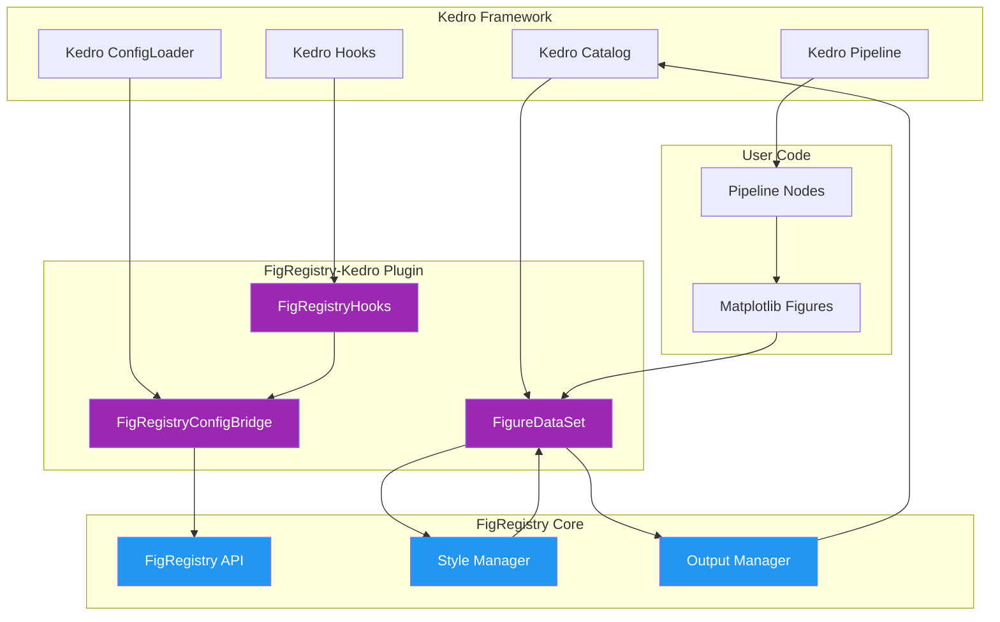
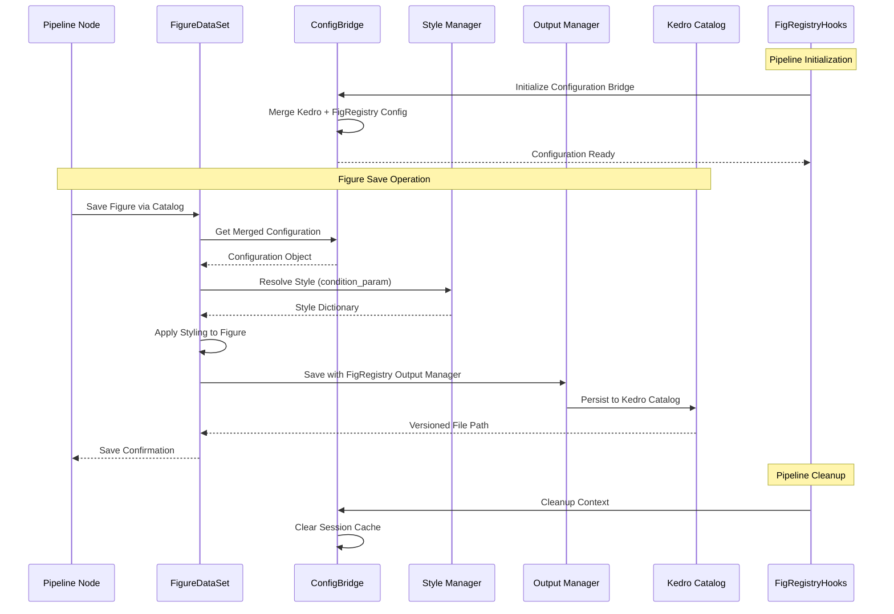

# FigRegistry-Kedro Plugin API Reference

The FigRegistry-Kedro plugin provides seamless integration between FigRegistry's scientific visualization management capabilities and Kedro's machine learning pipeline framework. This API reference covers all plugin components, providing comprehensive documentation for automated figure styling, versioning, and lifecycle management within Kedro workflows.

## Plugin Overview

The figregistry-kedro plugin consists of three core integration components that work together to provide zero-touch figure management in Kedro pipelines:

### Architecture Components



### Component Responsibilities

| Component | Primary Responsibility | Integration Point |
|-----------|----------------------|------------------|
| **[FigureDataSet](datasets.md)** | Automated figure styling and versioning in Kedro catalog | `kedro.io.AbstractDataSet` implementation |
| **[FigRegistryHooks](hooks.md)** | Lifecycle management and configuration initialization | Kedro hook specifications |
| **[FigRegistryConfigBridge](config.md)** | Configuration merging between Kedro and FigRegistry | Kedro ConfigLoader integration |

## Quick Start Reference

### Installation

```bash
pip install figregistry-kedro
```

### Basic Setup

1. **Add hooks to your Kedro project** (`settings.py`):

```python
from figregistry_kedro import FigRegistryHooks

HOOKS = (FigRegistryHooks(),)
```

2. **Configure FigureDataSet in catalog** (`catalog.yml`):

```yaml
experiment_plots:
  type: figregistry_kedro.FigureDataSet
  filepath: data/08_reporting/experiment_results.png
  purpose: presentation
  condition_param: experiment_condition
```

3. **Return matplotlib figures from pipeline nodes**:

```python
import matplotlib.pyplot as plt

def create_visualization(data):
    fig, ax = plt.subplots()
    ax.plot(data["x"], data["y"])
    ax.set_title("Analysis Results")
    return fig  # FigRegistry styling applied automatically
```

### Common Usage Patterns

#### Environment-Specific Styling

```yaml
# conf/base/catalog.yml
production_plots:
  type: figregistry_kedro.FigureDataSet
  filepath: data/08_reporting/results.png
  purpose: presentation

# conf/local/catalog.yml  
production_plots:
  purpose: exploratory  # Override for development
  style_params:
    figure.dpi: 150  # Lower DPI for faster development
```

#### Dynamic Condition Resolution

```yaml
# catalog.yml with condition parameters
analysis_plots:
  type: figregistry_kedro.FigureDataSet
  filepath: data/08_reporting/{condition}/analysis.png
  condition_param: experiment_condition
  style_params:
    figure.dpi: 300
    axes.grid: true
```

#### Versioned Figure Outputs

```yaml
# Kedro versioning integration
versioned_figures:
  type: figregistry_kedro.FigureDataSet
  filepath: data/08_reporting/versioned/analysis.png
  versioned: true
  purpose: publication
```

## Core API Components

### [FigureDataSet](datasets.md)

Custom Kedro `AbstractDataSet` implementation for matplotlib figure objects with automated FigRegistry styling and versioning.

**Key Features:**
- Automatic condition-based styling application
- Seamless Kedro catalog integration
- Thread-safe operation for parallel pipelines
- <5% performance overhead vs manual saves
- Support for Kedro versioning system

**Primary Methods:**
- `_save(data: Figure) -> None`: Save figure with styling
- `_describe() -> Dict[str, Any]`: Dataset metadata
- `_exists() -> bool`: Check file existence

[**→ View Detailed API Documentation**](datasets.md)

### [FigRegistryHooks](hooks.md)

Kedro lifecycle hooks for non-invasive FigRegistry initialization and context management throughout pipeline execution.

**Key Features:**
- Non-invasive integration preserving Kedro execution model
- Thread-safe configuration management
- <5ms hook execution overhead
- Automatic error handling and graceful degradation
- Support for environment-specific configurations

**Hook Methods:**
- `after_config_loaded()`: Initialize configuration bridge
- `before_pipeline_run()`: Setup pipeline context
- `after_pipeline_run()`: Resource cleanup

[**→ View Detailed API Documentation**](hooks.md)

### [FigRegistryConfigBridge](config.md)

Configuration translation layer between Kedro's ConfigLoader system and FigRegistry's YAML-based configuration management.

**Key Features:**
- Seamless configuration merging with type safety
- <10ms configuration merging overhead
- Environment-aware configuration handling
- Pydantic validation for merged configurations
- Thread-safe concurrent access patterns

**Primary Methods:**
- `get_merged_config() -> FigRegistryKedroConfig`: Unified configuration
- `clear_cache()`: Force configuration reload
- `init_config()`: Initialize configuration bridge

[**→ View Detailed API Documentation**](config.md)

## Data Flow Architecture



## Compatibility Matrix

### Python Versions

| Python Version | Support Status | Testing Status | Notes |
|---------------|----------------|----------------|-------|
| **3.10** | ✅ Full Support | ✅ Automated CI | Minimum required version |
| **3.11** | ✅ Full Support | ✅ Automated CI | Recommended version |
| **3.12** | ✅ Full Support | ✅ Automated CI | Latest stable support |
| **3.13** | ✅ Full Support | ✅ Automated CI | Forward compatibility |

### Kedro Framework Versions

| Kedro Version | Support Status | Integration Level | Notes |
|---------------|----------------|------------------|-------|
| **0.18.0** | ✅ Full Support | Complete AbstractDataSet API | Minimum required version |
| **0.18.x** | ✅ Full Support | All hook specifications | Stable LTS support |
| **0.19.x** | ✅ Full Support | Enhanced versioning features | Current stable |
| **0.20.x** | 🚧 Planned | Future compatibility | Under development |

### Core Dependencies

| Dependency | Version Requirement | Purpose | Integration Method |
|------------|-------------------|---------|-------------------|
| **figregistry** | `>=0.3.0` | Core visualization management | Direct API integration |
| **matplotlib** | `>=3.9.0` | Figure backend | Inherited from figregistry |
| **pydantic** | `>=2.9.0` | Configuration validation | Inherited from figregistry |
| **pyyaml** | `>=6.0.1` | YAML configuration parsing | Inherited from figregistry |

## Performance Specifications

### Operation Targets

| Operation | Target Performance | Typical Range | SLA Requirement |
|-----------|-------------------|---------------|-----------------|
| **Style Resolution** | <1ms | 0.1-0.8ms | Per figure styling lookup |
| **Configuration Merge** | <10ms | 2-8ms | Bridge initialization |
| **Figure Save** | <100ms | 20-80ms | Including matplotlib operations |
| **Hook Execution** | <5ms | 1-3ms | Per hook invocation |
| **Total Overhead** | <5% | 1-3% | vs manual matplotlib operations |

### Memory Usage

| Component | Memory Impact | Scaling Factor | Optimization |
|-----------|---------------|----------------|--------------|
| **Configuration Cache** | <2MB | Linear with config size | LRU cache with configurable limits |
| **Style Cache** | <1MB | Linear with unique conditions | Thread-safe with automatic cleanup |
| **Figure Processing** | Constant | Independent of pipeline size | Streaming operations |
| **Thread-Local Storage** | <100KB/thread | Linear with worker count | Automatic garbage collection |

### Concurrency Support

| Scenario | Recommended Workers | Performance Characteristics |
|----------|-------------------|---------------------------|
| **CPU-intensive analysis** | Up to CPU cores | Limited by matplotlib thread safety |
| **I/O-heavy workflows** | 2x CPU cores | Benefits from parallel I/O operations |
| **Memory-constrained environments** | 1-2 workers | Prevents memory exhaustion |
| **Large figure pipelines** | 4 workers max | Optimal for figure generation workflows |

## Error Handling

### Exception Hierarchy

```python
# Plugin-specific exceptions
from figregistry_kedro import (
    FigureDataSetError,           # Dataset operation failures
    HookExecutionError,           # Hook lifecycle failures  
    ConfigurationMergeError       # Configuration bridge failures
)

# Usage example
try:
    dataset = FigureDataSet(filepath="output.png")
    dataset._save(figure)
except FigureDataSetError as e:
    logger.error(f"Figure save failed: {e}")
    # Handle gracefully or retry
```

### Common Error Scenarios

| Error Type | Typical Cause | Resolution Strategy |
|------------|---------------|-------------------|
| **Missing Dependencies** | kedro or figregistry not installed | Install required packages |
| **Configuration Validation** | Invalid YAML or schema mismatch | Check configuration syntax |
| **Permission Errors** | Insufficient file system permissions | Verify output directory access |
| **Style Resolution** | Unknown condition or missing config | Provide fallback styling |

## Advanced Integration

### Multi-Environment Configuration

```yaml
# conf/base/figregistry.yml
styles:
  exploratory:
    figure.dpi: 100
    figure.facecolor: white
  
# conf/production/figregistry.yml
styles:
  exploratory:
    figure.dpi: 300  # High resolution for production
    figure.facecolor: white
    axes.grid: true
```

### Custom Hook Configuration

```python
# settings.py with custom hook parameters
from figregistry_kedro import FigRegistryHooks

HOOKS = (
    FigRegistryHooks(
        auto_initialize=True,
        enable_performance_monitoring=True,
        fallback_on_error=False,  # Strict mode
        max_initialization_time=0.003  # 3ms timeout
    ),
)
```

### Programmatic Dataset Creation

```python
from figregistry_kedro.datasets import create_figure_dataset

# Factory function for dynamic dataset creation
dataset = create_figure_dataset(
    filepath="dynamic_output.png",
    purpose="presentation", 
    condition_param="model_version",
    style_params={"figure.dpi": 300}
)
```

## Plugin Development

### Extending FigureDataSet

```python
from figregistry_kedro.datasets import FigureDataSet

class CustomFigureDataSet(FigureDataSet):
    """Extended dataset with custom processing."""
    
    def _save(self, data):
        # Custom pre-processing
        processed_figure = self._preprocess_figure(data)
        
        # Call parent save with styling
        super()._save(processed_figure)
        
        # Custom post-processing
        self._post_save_actions()
```

### Custom Hook Implementation

```python
from figregistry_kedro.hooks import FigRegistryHooks

class ExtendedFigRegistryHooks(FigRegistryHooks):
    """Enhanced hooks with custom lifecycle management."""
    
    def before_pipeline_run(self, run_params, pipeline, catalog):
        # Custom initialization
        super().before_pipeline_run(run_params, pipeline, catalog)
        
        # Additional setup
        self._setup_custom_context(run_params)
```

## Migration Guide

### From Manual matplotlib Workflow

**Before:**
```python
def create_and_save_plot(data):
    fig, ax = plt.subplots()
    ax.plot(data["x"], data["y"])
    
    # Manual styling
    ax.set_facecolor("white") 
    ax.grid(True, alpha=0.3)
    
    # Manual save
    plt.savefig("output.png", dpi=300, bbox_inches="tight")
    plt.close()
```

**After:**
```python
def create_plot(data):
    fig, ax = plt.subplots()
    ax.plot(data["x"], data["y"])
    
    # Styling and saving handled automatically
    return fig
```

```yaml
# catalog.yml
analysis_plot:
  type: figregistry_kedro.FigureDataSet
  filepath: data/08_reporting/output.png
  purpose: presentation
  style_params:
    figure.facecolor: white
    axes.grid: true
    axes.grid.alpha: 0.3
  save_args:
    dpi: 300
    bbox_inches: tight
```

### Migration Checklist

- [ ] Install figregistry-kedro plugin
- [ ] Add FigRegistryHooks to settings.py
- [ ] Convert manual save functions to return Figure objects
- [ ] Configure FigureDataSet entries in catalog.yml
- [ ] Move styling configuration to figregistry.yml
- [ ] Remove manual plt.savefig() calls from pipeline nodes
- [ ] Test environment-specific configurations
- [ ] Validate versioning and experiment tracking

## Community and Support

### Documentation Resources

- **[Installation Guide](../installation.md)**: Detailed setup instructions
- **[Configuration Guide](../configuration.md)**: Comprehensive configuration options
- **[Examples Repository](../../examples/)**: Working Kedro projects with plugin integration
- **[Migration Examples](../../examples/migration/)**: Before/after conversion examples

### API Reference Navigation

| Component | Documentation | Use Cases |
|-----------|---------------|-----------|
| **[FigureDataSet](datasets.md)** | Complete AbstractDataSet API | Figure automation in pipelines |
| **[FigRegistryHooks](hooks.md)** | Lifecycle hook specifications | Configuration and context management |
| **[FigRegistryConfigBridge](config.md)** | Configuration merging API | Environment-specific setups |

### GitHub Repository

Visit the [figregistry-kedro repository](https://github.com/blitzy-platform/figregistry-kedro) for:

- Source code and development
- Issue tracking and bug reports
- Feature requests and discussions
- Community contributions

### Version Information

```python
import figregistry_kedro
print(f"Plugin version: {figregistry_kedro.__version__}")
print(f"Compatibility: {figregistry_kedro.get_plugin_info()}")
```

---

**Need Help?** Check the [examples directory](../../examples/) for complete working projects, or open an issue on the [GitHub repository](https://github.com/blitzy-platform/figregistry-kedro) for community support.