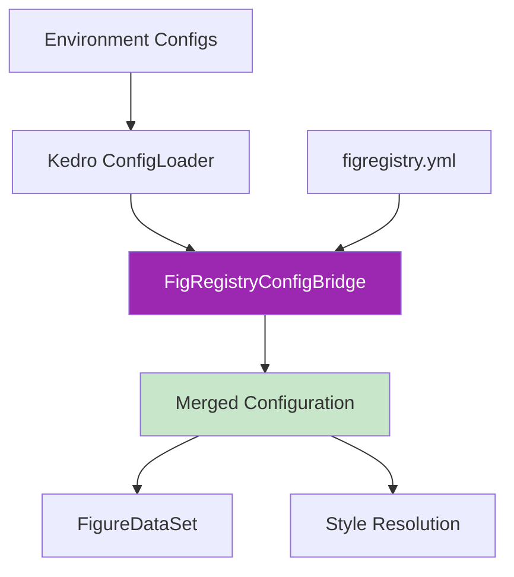

# Configuration Guide

This guide provides comprehensive information on configuring the figregistry-kedro plugin to integrate FigRegistry's visualization management capabilities with Kedro machine learning pipelines.

## Table of Contents

- [Overview](#overview)
- [Configuration Architecture](#configuration-architecture)
- [YAML Configuration Files](#yaml-configuration-files)
- [Environment-Specific Configuration](#environment-specific-configuration)
- [Kedro Catalog Integration](#kedro-catalog-integration)
- [Hook Registration](#hook-registration)
- [Configuration Precedence](#configuration-precedence)
- [Advanced Configuration](#advanced-configuration)
- [Troubleshooting](#troubleshooting)

## Overview

The figregistry-kedro plugin provides seamless integration between FigRegistry's configuration-driven visualization system and Kedro's catalog-based data pipeline architecture. The integration introduces three key configuration components:

1. **FigRegistryConfigBridge**: Merges Kedro and FigRegistry configurations
2. **FigureDataSet**: Custom Kedro dataset with FigRegistry parameters
3. **FigRegistryHooks**: Lifecycle hooks for configuration initialization

## Configuration Architecture

The plugin uses a layered configuration approach that respects both Kedro and FigRegistry conventions:



### Configuration Flow

1. **Initialization**: FigRegistryHooks trigger configuration merging during pipeline startup
2. **Loading**: ConfigBridge combines Kedro environment configs with figregistry.yml
3. **Validation**: Pydantic validates merged configuration against FigRegistry schema
4. **Application**: FigureDataSet uses merged config for automatic styling and output

## YAML Configuration Files

### Base FigRegistry Configuration

Create `conf/base/figregistry.yml` in your Kedro project to define core FigRegistry settings:

```yaml
# conf/base/figregistry.yml
figregistry_version: ">=0.3.0"

# Condition-based styling definitions
condition_styles:
  training:
    color: "#2E86AB"
    marker: "o"
    linestyle: "-"
    label: "Training Data"
  
  validation:
    color: "#A23B72"
    marker: "s"
    linestyle: "--"
    label: "Validation Data"
  
  test:
    color: "#F18F01"
    marker: "^"
    linestyle: ":"
    label: "Test Data"
  
  # Wildcard patterns for flexible matching
  "model_*":
    color: "#C73E1D"
    marker: "D"
    linestyle: "-."

# Output path configurations
paths:
  base_dir: "data/08_reporting"
  
  # Path aliases for different purposes
  aliases:
    expl: "exploratory"
    pres: "presentation" 
    pub: "publication"

# File naming configuration
naming:
  timestamp_format: "%Y%m%d_%H%M%S"
  filename_template: "{name}_{ts}"

# Default styling palettes
palettes:
  default:
    colors: ["#2E86AB", "#A23B72", "#F18F01", "#C73E1D"]
    markers: ["o", "s", "^", "D"]
    linestyles: ["-", "--", ":", "-."]

# Metadata for output files
metadata:
  author: "Data Science Team"
  project: "Kedro ML Pipeline"
  include_timestamp: true
```

### Kedro-Specific Configuration Extensions

Add Kedro-specific configurations to support pipeline integration:

```yaml
# conf/base/figregistry.yml (continued)

# Kedro integration settings
kedro:
  # Dataset configuration defaults
  dataset_defaults:
    purpose: "expl"  # Default purpose for FigureDataSet
    dpi: 300
    format: "png"
  
  # Hook configuration
  hooks:
    auto_init: true
    log_operations: true
    context_injection: true
  
  # Catalog integration
  catalog:
    versioning_enabled: true
    layer_mapping:
      reporting: "pub"
      intermediate: "expl"
      primary: "pres"
```

## Environment-Specific Configuration

The plugin supports Kedro's environment-specific configuration patterns, allowing different settings for development, staging, and production environments.

### Local Development Environment

```yaml
# conf/local/figregistry.yml
paths:
  base_dir: "data/08_reporting/dev"

naming:
  filename_template: "dev_{name}_{ts}"

kedro:
  hooks:
    log_operations: true  # Enable verbose logging in development
  
  dataset_defaults:
    dpi: 150  # Lower DPI for faster development cycles
```

### Production Environment

```yaml
# conf/production/figregistry.yml
paths:
  base_dir: "/opt/ml/output/figures"

naming:
  filename_template: "prod_{name}_{ts}"

kedro:
  hooks:
    log_operations: false  # Reduce logging in production
  
  dataset_defaults:
    dpi: 300
    format: "pdf"  # High-quality outputs for production
```

### Staging Environment

```yaml
# conf/staging/figregistry.yml
paths:
  base_dir: "s3://ml-artifacts/staging/figures"

condition_styles:
  # Override specific styles for staging validation
  validation:
    color: "#FF6B6B"  # Different color for staging visibility

kedro:
  dataset_defaults:
    purpose: "pres"  # Default to presentation quality in staging
```

## Kedro Catalog Integration

### FigureDataSet Configuration

Configure FigureDataSet entries in your Kedro catalog with FigRegistry-specific parameters:

```yaml
# conf/base/catalog.yml

# Basic figure output with automatic styling
training_accuracy_plot:
  type: figregistry_kedro.datasets.FigureDataSet
  filepath: data/08_reporting/training_accuracy.png
  purpose: expl
  condition_param: "data_split"  # Resolve condition from pipeline parameters
  
# Advanced configuration with style overrides
model_performance_comparison:
  type: figregistry_kedro.datasets.FigureDataSet
  filepath: data/08_reporting/model_comparison.pdf
  purpose: pub
  condition_param: "model_type"
  style_params:
    dpi: 300
    bbox_inches: "tight"
    facecolor: "white"
  versioned: true

# Multiple outputs with different purposes
exploratory_plots:
  type: figregistry_kedro.datasets.FigureDataSet
  filepath: data/08_reporting/exploration/{condition}.png
  purpose: expl
  condition_param: "experiment_name"
  
presentation_figures:
  type: figregistry_kedro.datasets.FigureDataSet  
  filepath: data/08_reporting/presentation/{condition}.svg
  purpose: pres
  condition_param: "experiment_name"
  style_params:
    format: "svg"
    transparent: true
```

### FigureDataSet Parameters

| Parameter | Type | Required | Description |
|-----------|------|----------|-------------|
| `type` | string | Yes | Must be `figregistry_kedro.datasets.FigureDataSet` |
| `filepath` | string | Yes | Output file path (supports templating) |
| `purpose` | string | No | Output purpose: `expl`, `pres`, or `pub` (default: `expl`) |
| `condition_param` | string | No | Pipeline parameter name for condition resolution |
| `style_params` | dict | No | Override styling parameters for this dataset |
| `versioned` | bool | No | Enable Kedro versioning (default: `false`) |

### Condition Parameter Resolution

The `condition_param` enables dynamic styling based on pipeline execution context:

```python
# In your pipeline node
def create_model_plot(model_results, parameters):
    """Generate model performance plot."""
    fig, ax = plt.subplots()
    
    # Plot your results
    ax.plot(model_results['epochs'], model_results['accuracy'])
    ax.set_title('Model Performance')
    
    # No manual styling needed - FigureDataSet handles it automatically
    # Styling resolved from parameters[condition_param] value
    return fig

# Pipeline definition
def create_pipeline(**kwargs):
    return Pipeline([
        node(
            func=create_model_plot,
            inputs=["model_results", "parameters"],
            outputs="training_accuracy_plot",  # References catalog entry
            name="plot_training_accuracy"
        )
    ])
```

## Hook Registration

### Basic Hook Registration

Register FigRegistryHooks in your Kedro project settings:

```python
# src/your_project/settings.py
from figregistry_kedro.hooks import FigRegistryHooks

# Basic registration
HOOKS = (FigRegistryHooks(),)
```

### Advanced Hook Configuration

Configure hooks with custom parameters:

```python
# src/your_project/settings.py
from figregistry_kedro.hooks import FigRegistryHooks

# Advanced configuration
HOOKS = (
    FigRegistryHooks(
        auto_init=True,           # Automatically initialize FigRegistry
        log_operations=True,      # Log configuration operations
        context_injection=True,   # Inject config into pipeline context
        config_path="conf/figregistry.yml"  # Custom config path
    ),
)
```

### Hook Integration with Existing Hooks

Combine with other Kedro hooks:

```python
# src/your_project/settings.py
from kedro.framework.hooks import hook_impl
from figregistry_kedro.hooks import FigRegistryHooks
from your_project.hooks import ProjectHooks

class CombinedHooks:
    """Custom hooks that work alongside FigRegistry."""
    
    @hook_impl
    def before_pipeline_run(self, run_params, pipeline, catalog):
        """Custom pre-pipeline logic."""
        # Your custom logic here
        pass

HOOKS = (
    FigRegistryHooks(),
    ProjectHooks(),
    CombinedHooks(),
)
```

## Configuration Precedence

The plugin follows a clear precedence hierarchy for configuration merging:

### Precedence Order (Highest to Lowest)

1. **Environment-specific overrides** (`conf/{env}/figregistry.yml`)
2. **Dataset-specific style_params** (in catalog configuration)
3. **Base Kedro configuration** (`conf/base/figregistry.yml`)
4. **FigRegistry defaults** (built-in defaults)

### Merging Behavior

```yaml
# Example: How configurations merge

# Base configuration (conf/base/figregistry.yml)
condition_styles:
  training:
    color: "#2E86AB"
    marker: "o"

paths:
  base_dir: "data/08_reporting"

# Environment override (conf/production/figregistry.yml)  
condition_styles:
  training:
    marker: "s"  # Overrides base marker, keeps base color

paths:
  base_dir: "/opt/ml/output"  # Completely overrides base path

# Result: Merged configuration
condition_styles:
  training:
    color: "#2E86AB"    # From base
    marker: "s"         # From production override

paths:
  base_dir: "/opt/ml/output"  # From production override
```

## Advanced Configuration

### Custom Configuration Bridge

For advanced scenarios, you can extend the configuration bridge:

```python
# Custom configuration bridge
from figregistry_kedro.config import FigRegistryConfigBridge
from kedro.config import ConfigLoader

class CustomConfigBridge(FigRegistryConfigBridge):
    """Extended configuration bridge with custom logic."""
    
    def merge_configs(self, kedro_config, figregistry_config):
        """Custom merging logic."""
        # Add your custom merging logic here
        merged = super().merge_configs(kedro_config, figregistry_config)
        
        # Apply custom transformations
        merged = self._apply_custom_transforms(merged)
        
        return merged
    
    def _apply_custom_transforms(self, config):
        """Apply project-specific configuration transforms."""
        # Example: Dynamic path generation based on environment
        if self.environment == "production":
            config["paths"]["base_dir"] = f"/opt/ml/{config['metadata']['project']}"
        
        return config
```

### Dynamic Condition Resolution

Implement dynamic condition resolution for complex scenarios:

```python
# Advanced condition parameter resolution
def advanced_plotting_node(data, parameters, context):
    """Node with dynamic condition resolution."""
    fig, ax = plt.subplots()
    
    # Generate plot
    ax.plot(data['x'], data['y'])
    
    # Dynamic condition based on data characteristics
    condition = determine_condition(data, parameters)
    
    # Store condition in context for FigureDataSet
    context.params["dynamic_condition"] = condition
    
    return fig

def determine_condition(data, parameters):
    """Determine styling condition based on data and parameters."""
    if parameters.get("model_type") == "neural_network":
        if len(data) > 10000:
            return "large_neural_network"
        else:
            return "small_neural_network"
    else:
        return parameters.get("model_type", "default")
```

### Conditional Dataset Configuration

Use Kedro's conditional configuration for complex scenarios:

```yaml
# conf/base/catalog.yml with conditional configuration

advanced_analysis_plot:
  type: figregistry_kedro.datasets.FigureDataSet
  filepath: data/08_reporting/advanced_analysis.png
  purpose: pub
  condition_param: "analysis_type"
  style_params:
    dpi: 600
    format: "pdf"


# Environment-specific dataset variations

production_dashboard:
  type: figregistry_kedro.datasets.FigureDataSet
  filepath: /opt/ml/dashboard/live_metrics.svg
  purpose: pres
  condition_param: "dashboard_type"

```

## Troubleshooting

### Common Configuration Issues

#### Configuration Not Loading

**Problem**: FigRegistry configuration not being applied to figures.

**Solution**: Verify hook registration and configuration paths:

```bash
# Check if hooks are registered
grep -r "FigRegistryHooks" src/*/settings.py

# Verify configuration file exists
ls -la conf/base/figregistry.yml

# Check configuration validation
kedro run --pipeline=your_pipeline --params="log_level:DEBUG"
```

#### Style Resolution Failures

**Problem**: Conditions not resolving to expected styles.

**Solution**: Debug condition parameter resolution:

```python
# Add debug logging to your nodes
import logging
logger = logging.getLogger(__name__)

def debug_plotting_node(data, parameters):
    condition_value = parameters.get("condition_param_name")
    logger.info(f"Resolving condition: {condition_value}")
    
    # Create your plot
    fig, ax = plt.subplots()
    # ... plot creation ...
    
    return fig
```

#### Environment Configuration Conflicts

**Problem**: Environment-specific settings not being applied correctly.

**Solution**: Check configuration precedence:

```bash
# View merged configuration
kedro registry describe

# Test specific environment
kedro run --env=production --params="debug_config:true"
```

### Validation Errors

#### Schema Validation Failures

```yaml
# Common validation issues and fixes

# ❌ Invalid: Missing required version
condition_styles:
  training:
    color: "blue"

# ✅ Valid: Include required version
figregistry_version: ">=0.3.0"
condition_styles:
  training:
    color: "blue"

# ❌ Invalid: Invalid color format  
condition_styles:
  training:
    color: "not-a-color"

# ✅ Valid: Use hex or named colors
condition_styles:
  training:
    color: "#2E86AB"  # or "blue"
```

#### Dataset Configuration Errors

```yaml
# ❌ Invalid: Missing required type
training_plot:
  filepath: data/plots/training.png
  
# ✅ Valid: Include required type
training_plot:
  type: figregistry_kedro.datasets.FigureDataSet
  filepath: data/plots/training.png

# ❌ Invalid: Invalid purpose value
model_plot:
  type: figregistry_kedro.datasets.FigureDataSet
  filepath: data/plots/model.png
  purpose: "invalid_purpose"
  
# ✅ Valid: Use valid purpose values
model_plot:
  type: figregistry_kedro.datasets.FigureDataSet  
  filepath: data/plots/model.png
  purpose: "pub"  # expl, pres, or pub
```

### Performance Optimization

#### Configuration Caching

The plugin automatically caches merged configurations for performance. To optimize:

```python
# In your settings.py - configure caching behavior
HOOKS = (
    FigRegistryHooks(
        cache_config=True,        # Enable configuration caching
        cache_ttl=3600,          # Cache TTL in seconds
        lazy_loading=True        # Load configuration only when needed
    ),
)
```

#### Large Configuration Files

For projects with large configuration files:

```yaml
# Split configurations into multiple files
# conf/base/figregistry/
#   ├── main.yml
#   ├── styles.yml
#   └── paths.yml

# Main configuration
figregistry_version: ">=0.3.0"

# Include other files
includes:
  - "figregistry/styles.yml"
  - "figregistry/paths.yml"
```

### Getting Help

If you encounter issues not covered in this guide:

1. **Check the logs**: Enable debug logging to see detailed configuration operations
2. **Validate configuration**: Use Kedro's built-in configuration validation
3. **Review examples**: Check the example projects in the `examples/` directory
4. **Submit issues**: Report bugs or request features on GitHub

For additional support, consult the [API Reference](api/index.md) and [Installation Guide](installation.md).