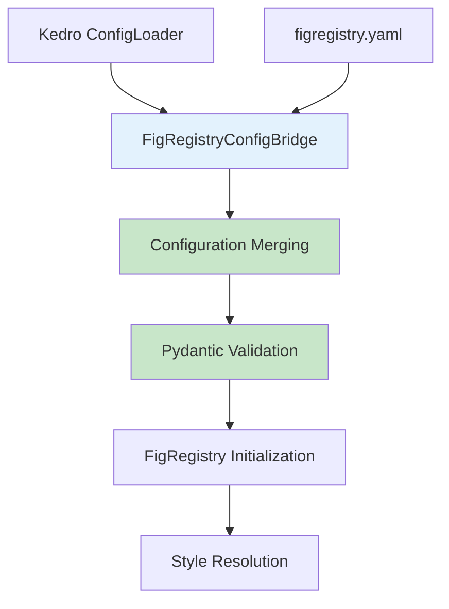

# Configuration Guide

This comprehensive guide covers configuration management for the figregistry-kedro plugin, including YAML configuration merging, environment-specific settings, and Kedro catalog integration. The plugin provides seamless integration between Kedro's ConfigLoader system and FigRegistry's condition-based styling through the FigRegistryConfigBridge component.

## Table of Contents

- [Overview](#overview)
- [Configuration Bridge Architecture](#configuration-bridge-architecture)
- [Environment-Specific Configuration](#environment-specific-configuration)
- [Kedro Catalog Integration](#kedro-catalog-integration)
- [FigureDataSet Configuration](#figuredataset-configuration)
- [Hook Registration](#hook-registration)
- [Configuration Precedence Rules](#configuration-precedence-rules)
- [Advanced Configuration](#advanced-configuration)
- [Performance Considerations](#performance-considerations)
- [Troubleshooting](#troubleshooting)

## Overview

The figregistry-kedro plugin introduces a unified configuration system that bridges Kedro's environment-specific configuration management with FigRegistry's condition-based styling system. This integration enables:

- **Seamless Configuration Merging**: Automatic merging of `figregistry.yaml` with Kedro project configurations
- **Environment-Specific Overrides**: Support for development, staging, and production-specific styling parameters
- **Type-Safe Validation**: Pydantic-based validation ensuring configuration correctness across both systems
- **Performance Optimization**: Configuration caching with <10ms merging overhead
- **Zero-Touch Integration**: Automatic initialization through Kedro's lifecycle hooks

## Configuration Bridge Architecture

The `FigRegistryConfigBridge` serves as the translation layer between Kedro's ConfigLoader and FigRegistry's YAML-based configuration management. This bridge enables unified configuration management while maintaining the design principles of both frameworks.

### Core Components



### Configuration Sources

The bridge merges configuration from multiple sources with defined precedence:

1. **Standalone figregistry.yaml**: Traditional FigRegistry configuration file
2. **Kedro Base Configuration**: `conf/base/figregistry.yml`
3. **Environment-Specific Overrides**: `conf/local/figregistry.yml`, `conf/production/figregistry.yml`
4. **Runtime Parameters**: Pipeline-specific overrides through catalog configuration

## Environment-Specific Configuration

### Directory Structure

```
kedro-project/
├── conf/
│   ├── base/
│   │   ├── catalog.yml
│   │   ├── parameters.yml
│   │   └── figregistry.yml          # Base FigRegistry config
│   ├── local/
│   │   ├── credentials.yml
│   │   └── figregistry.yml          # Development overrides
│   ├── staging/
│   │   └── figregistry.yml          # Staging environment config
│   └── production/
│       └── figregistry.yml          # Production environment config
├── figregistry.yaml                 # Optional standalone config
└── src/
```

### Base Configuration (conf/base/figregistry.yml)

```yaml
# Base FigRegistry configuration for all environments
styles:
  exploratory:
    figure.figsize: [10, 6]
    figure.dpi: 100
    axes.grid: true
    axes.spines.top: false
    axes.spines.right: false
  
  presentation:
    figure.figsize: [12, 8]
    figure.dpi: 150
    font.size: 14
    axes.labelsize: 16
    axes.titlesize: 18
  
  publication:
    figure.figsize: [8, 6]
    figure.dpi: 300
    font.family: serif
    font.size: 12
    axes.linewidth: 1.5

palettes:
  default:
    colors: ['#1f77b4', '#ff7f0e', '#2ca02c', '#d62728']
  
  colorblind_safe:
    colors: ['#1b9e77', '#d95f02', '#7570b3', '#e7298a']

outputs:
  base_path: data/08_reporting
  create_subdirs: true
  timestamp_format: "%Y%m%d_%H%M%S"
  
defaults:
  purpose: exploratory
  format: png
  bbox_inches: tight
  
# Kedro-specific configuration
kedro:
  catalog_integration:
    auto_register_datasets: true
    versioning_enabled: true
  
  hook_settings:
    auto_initialize: true
    enable_performance_monitoring: false
    fallback_on_error: true
```

### Environment-Specific Overrides

#### Development Environment (conf/local/figregistry.yml)

```yaml
# Development environment overrides
styles:
  exploratory:
    figure.dpi: 72  # Lower DPI for faster rendering
    
outputs:
  base_path: data/08_reporting/dev
  
defaults:
  format: png  # PNG for quick iteration
  
kedro:
  hook_settings:
    enable_performance_monitoring: true  # Enable monitoring in development
```

#### Production Environment (conf/production/figregistry.yml)

```yaml
# Production environment overrides
styles:
  presentation:
    figure.dpi: 300  # High DPI for production
  
  publication:
    figure.dpi: 600  # Ultra-high DPI for publications
    
outputs:
  base_path: /opt/data/reports
  create_subdirs: true
  
defaults:
  format: pdf  # PDF for production outputs
  transparent: false
  
kedro:
  catalog_integration:
    versioning_enabled: true
  
  hook_settings:
    enable_performance_monitoring: false
    fallback_on_error: false  # Strict error handling in production
```

#### Staging Environment (conf/staging/figregistry.yml)

```yaml
# Staging environment for testing production-like settings
styles:
  presentation:
    figure.dpi: 200
    
outputs:
  base_path: /tmp/staging_reports
  
defaults:
  format: pdf
  
kedro:
  hook_settings:
    enable_performance_monitoring: true
    fallback_on_error: false
```

## Kedro Catalog Integration

### FigureDataSet in Data Catalog

The plugin integrates with Kedro's data catalog through the `FigureDataSet` custom dataset type, which applies FigRegistry styling automatically during figure save operations.

#### Basic Catalog Configuration (catalog.yml)

```yaml
# Exploratory analysis figures
exploratory_plots:
  type: figregistry_kedro.FigureDataSet
  filepath: data/08_reporting/exploratory/{default_run_id}_analysis.png
  purpose: exploratory

# Presentation-ready figures
presentation_plots:
  type: figregistry_kedro.FigureDataSet
  filepath: data/08_reporting/presentation/{default_run_id}_results.pdf
  purpose: presentation
  save_args:
    bbox_inches: tight
    transparent: false

# Publication-quality figures  
publication_plots:
  type: figregistry_kedro.FigureDataSet
  filepath: data/08_reporting/publication/{default_run_id}_figure_{version}.pdf
  purpose: publication
  save_args:
    dpi: 600
    format: pdf
    bbox_inches: tight
```

#### Advanced Catalog Configuration with Dynamic Conditions

```yaml
# Dynamic condition resolution from pipeline parameters
experiment_results:
  type: figregistry_kedro.FigureDataSet
  filepath: data/08_reporting/experiments/{default_run_id}_{params:experiment_name}.png
  purpose: presentation
  condition_param: experiment_condition  # Resolved from pipeline parameters
  style_params:
    # Dataset-specific style overrides
    figure.facecolor: white
    axes.facecolor: '#f8f9fa'
  save_args:
    dpi: 300
    bbox_inches: tight

# Multi-condition styling based on model type and dataset
model_comparison:
  type: figregistry_kedro.FigureDataSet
  filepath: data/08_reporting/models/{params:model_type}_{params:dataset_name}.pdf
  purpose: publication
  condition_param: model_dataset_combination
  style_params:
    figure.figsize: [12, 8]
    font.family: serif
  save_args:
    format: pdf
    dpi: 600
    transparent: false

# Versioned datasets with automatic styling
training_curves:
  type: figregistry_kedro.FigureDataSet
  filepath: data/08_reporting/training/{default_run_id}_curves.png
  purpose: exploratory
  versioned: true  # Enable Kedro's built-in versioning
  condition_param: training_regime
```

#### Environment-Specific Catalog Overrides

```yaml
# In conf/local/catalog.yml - development overrides
exploratory_plots:
  filepath: data/08_reporting/dev/exploratory_{default_run_id}.png
  save_args:
    dpi: 100  # Lower DPI for development

# In conf/production/catalog.yml - production overrides  
publication_plots:
  filepath: /opt/data/reports/production/figures_{default_run_id}.pdf
  save_args:
    dpi: 600
    format: pdf
```

## FigureDataSet Configuration

### Configuration Parameters

The `FigureDataSet` provides comprehensive configuration options for automated figure styling and persistence:

#### Core Parameters

| Parameter | Type | Default | Description |
|-----------|------|---------|-------------|
| `filepath` | `str` | **Required** | Output file path for the figure. Supports Kedro templating (`{default_run_id}`, `{params:name}`) |
| `purpose` | `str` | `"exploratory"` | Output categorization for style selection: `exploratory`, `presentation`, or `publication` |
| `condition_param` | `str` | `None` | Parameter name for dynamic condition resolution from pipeline context |
| `style_params` | `Dict[str, Any]` | `{}` | Dataset-specific styling overrides that take precedence over condition-based styles |
| `save_args` | `Dict[str, Any]` | `{}` | Additional arguments passed to matplotlib's `savefig` method |
| `load_args` | `Dict[str, Any]` | `{}` | Additional arguments for figure loading (currently unused) |
| `version` | `str` | `None` | Dataset version for Kedro's versioning system |

#### Style Parameters

Style parameters support all matplotlib rcParams with additional FigRegistry-specific options:

```yaml
style_params:
  # Figure properties
  figure.figsize: [12, 8]
  figure.dpi: 300
  figure.facecolor: white
  figure.edgecolor: none
  
  # Axes properties
  axes.grid: true
  axes.spines.top: false
  axes.spines.right: false
  axes.linewidth: 1.5
  axes.labelsize: 14
  axes.titlesize: 16
  
  # Font properties
  font.family: sans-serif
  font.size: 12
  font.weight: normal
  
  # Line and marker properties
  lines.linewidth: 2.0
  lines.markersize: 8
  
  # Color and palette
  axes.prop_cycle: "cycler('color', ['#1f77b4', '#ff7f0e', '#2ca02c'])"
```

#### Save Arguments

Common matplotlib `savefig` arguments supported through `save_args`:

```yaml
save_args:
  dpi: 300                    # Resolution in dots per inch
  format: pdf                 # Output format (png, pdf, svg, eps, ps)
  bbox_inches: tight         # Bounding box optimization
  transparent: false         # Transparent background
  facecolor: auto           # Figure face color
  edgecolor: none           # Figure edge color
  orientation: portrait     # Page orientation for PDF
  papertype: letter         # Paper size for PDF
  pad_inches: 0.1           # Padding around figure
  metadata:                 # PDF/PS metadata
    Title: "Analysis Results"
    Author: "Data Science Team"
    Subject: "Experimental Analysis"
    Keywords: "machine learning, visualization"
    Creator: "figregistry-kedro"
```

### Dynamic Condition Resolution

The `condition_param` enables dynamic style selection based on pipeline parameters:

#### Pipeline Parameters (parameters.yml)

```yaml
# Experiment configuration
experiment_condition: "high_learning_rate"
model_type: "random_forest"
dataset_name: "customer_data"
training_regime: "extended"

# Combined conditions for complex styling
model_dataset_combination: "random_forest_customer_data"
```

#### Corresponding Style Configuration (figregistry.yml)

```yaml
styles:
  # Simple condition-based styling
  high_learning_rate:
    lines.color: '#d62728'  # Red for high learning rate
    lines.linewidth: 3.0
    
  low_learning_rate:
    lines.color: '#2ca02c'  # Green for low learning rate
    lines.linewidth: 2.0
  
  # Complex combined conditions  
  random_forest_customer_data:
    figure.figsize: [14, 10]
    axes.grid: true
    lines.marker: 'o'
    lines.markersize: 6
    
  # Training regime specific styles
  extended:
    figure.figsize: [16, 12]
    axes.labelsize: 16
    font.size: 14
```

#### Pipeline Node Example

```python
def create_training_plot(training_data: pd.DataFrame) -> Figure:
    """Create training curve visualization.
    
    The condition will be automatically resolved from parameters
    and appropriate styling applied during catalog save.
    """
    fig, ax = plt.subplots()
    
    # Create the plot content
    ax.plot(training_data['epoch'], training_data['loss'], label='Training Loss')
    ax.plot(training_data['epoch'], training_data['val_loss'], label='Validation Loss')
    
    ax.set_xlabel('Epoch')
    ax.set_ylabel('Loss')
    ax.legend()
    ax.set_title('Training Progress')
    
    # No manual styling or saving - handled automatically by FigureDataSet
    return fig
```

## Hook Registration

### Basic Hook Registration

Add FigRegistry hooks to your Kedro project's `settings.py`:

```python
# src/project_name/settings.py

from figregistry_kedro.hooks import FigRegistryHooks

# Basic hook registration
HOOKS = (FigRegistryHooks(),)

# Or with existing hooks
HOOKS = (
    FigRegistryHooks(),
    # ... other hooks
)
```

### Advanced Hook Configuration

```python
# src/project_name/settings.py

from figregistry_kedro.hooks import FigRegistryHooks

# Configure hook behavior
HOOKS = (
    FigRegistryHooks(
        auto_initialize=True,                    # Automatically initialize FigRegistry
        enable_performance_monitoring=True,     # Enable detailed timing logs
        fallback_on_error=True,                 # Continue if initialization fails
        max_initialization_time=0.005           # 5ms maximum initialization time
    ),
)
```

### Hook Configuration Options

| Parameter | Type | Default | Description |
|-----------|------|---------|-------------|
| `auto_initialize` | `bool` | `True` | Automatically initialize FigRegistry configuration during pipeline startup |
| `enable_performance_monitoring` | `bool` | `False` | Enable detailed performance timing logs for optimization |
| `fallback_on_error` | `bool` | `True` | Continue pipeline execution if FigRegistry initialization fails |
| `max_initialization_time` | `float` | `0.005` | Maximum allowed initialization time in seconds (5ms default) |

### Hook Lifecycle Events

The hooks integrate with Kedro's lifecycle through specific events:

```python
# Automatic lifecycle integration - no manual configuration required

class FigRegistryHooks:
    @hook_impl
    def after_config_loaded(self, context: KedroContext, config_loader: ConfigLoader):
        """Initialize configuration bridge after Kedro config is loaded."""
        # Creates FigRegistryConfigBridge
        # Merges figregistry.yaml with Kedro configurations
        # Validates merged configuration
        
    @hook_impl  
    def before_pipeline_run(self, run_params: Dict[str, Any], pipeline: Pipeline, catalog: DataCatalog):
        """Initialize FigRegistry before pipeline execution."""
        # Initializes FigRegistry with merged configuration
        # Sets up pipeline context for dynamic condition resolution
        # Registers active pipeline for state tracking
        
    @hook_impl
    def after_pipeline_run(self, run_params: Dict[str, Any], pipeline: Pipeline, catalog: DataCatalog):
        """Clean up after pipeline execution."""
        # Unregisters pipeline from active tracking
        # Performs optional cleanup operations
```

## Configuration Precedence Rules

The configuration bridge implements a clear hierarchy for resolving configuration conflicts:

### Precedence Order (Highest to Lowest)

1. **Runtime Style Parameters**: `style_params` in FigureDataSet configuration
2. **Environment-Specific Kedro Config**: `conf/{environment}/figregistry.yml`
3. **Base Kedro Configuration**: `conf/base/figregistry.yml`
4. **Standalone FigRegistry Config**: `figregistry.yaml`
5. **FigRegistry Defaults**: Built-in default values

### Merging Behavior

#### Deep Merging for Nested Objects

```yaml
# Base configuration (conf/base/figregistry.yml)
styles:
  exploratory:
    figure.figsize: [10, 6]
    figure.dpi: 100
    axes.grid: true

# Environment override (conf/production/figregistry.yml)  
styles:
  exploratory:
    figure.dpi: 300  # Override DPI only
    font.size: 12    # Add new property

# Merged result:
styles:
  exploratory:
    figure.figsize: [10, 6]  # Preserved from base
    figure.dpi: 300          # Overridden by environment
    axes.grid: true          # Preserved from base  
    font.size: 12           # Added by environment
```

#### List Replacement (No Merging)

```yaml
# Base configuration
palettes:
  default:
    colors: ['#1f77b4', '#ff7f0e', '#2ca02c']

# Environment override
palettes:
  default:
    colors: ['#d62728', '#9467bd']  # Completely replaces base colors

# Merged result (lists are replaced, not merged):
palettes:
  default:
    colors: ['#d62728', '#9467bd']  # Environment list wins
```

#### Runtime Parameter Override Example

```yaml
# Catalog configuration with style_params
experiment_plot:
  type: figregistry_kedro.FigureDataSet
  filepath: data/results.png
  purpose: presentation
  style_params:
    figure.dpi: 600      # Highest precedence - overrides all other sources
    font.family: serif
```

## Advanced Configuration

### Multi-Environment Project Setup

For complex projects with multiple deployment environments:

```yaml
# conf/base/figregistry.yml - Common baseline
styles:
  base_style: &base_style
    figure.figsize: [10, 6]
    axes.grid: true
    axes.spines.top: false
    axes.spines.right: false

  exploratory:
    <<: *base_style
    figure.dpi: 100
    
  presentation:
    <<: *base_style  
    figure.dpi: 200
    font.size: 14
    
  publication:
    <<: *base_style
    figure.dpi: 300
    font.family: serif

# conf/local/figregistry.yml - Development
styles:
  exploratory:
    figure.dpi: 72      # Fast rendering for development
  
kedro:
  hook_settings:
    enable_performance_monitoring: true

# conf/staging/figregistry.yml - Staging
styles:
  presentation:
    figure.dpi: 250     # Production-like but slightly lower
    
outputs:
  base_path: /tmp/staging_reports

# conf/production/figregistry.yml - Production  
styles:
  presentation:
    figure.dpi: 300
  publication:
    figure.dpi: 600
    
outputs:
  base_path: /opt/production_reports
  
kedro:
  hook_settings:
    fallback_on_error: false  # Strict error handling
```

### Conditional Configuration with YAML Anchors

```yaml
# Advanced YAML features for configuration management

# Define reusable style components
_style_components:
  high_dpi: &high_dpi
    figure.dpi: 300
    
  publication_fonts: &pub_fonts
    font.family: serif
    font.size: 12
    axes.labelsize: 14
    
  clean_axes: &clean_axes
    axes.spines.top: false
    axes.spines.right: false
    axes.grid: true
    axes.grid.alpha: 0.3

# Compose styles from components
styles:
  exploratory:
    figure.figsize: [10, 6]
    figure.dpi: 100
    <<: *clean_axes
    
  presentation:
    figure.figsize: [12, 8]
    <<: [*high_dpi, *clean_axes]
    font.size: 14
    
  publication:
    figure.figsize: [8, 6]
    <<: [*high_dpi, *pub_fonts, *clean_axes]
    figure.dpi: 600  # Override the high_dpi setting
```

### Performance Optimization Configuration

```yaml
# Optimize for high-volume figure generation
kedro:
  catalog_integration:
    auto_register_datasets: true
    versioning_enabled: false      # Disable for performance
    
  hook_settings:
    auto_initialize: true
    enable_performance_monitoring: false  # Disable overhead
    max_initialization_time: 0.003        # Stricter timing
    
# Cache-friendly configuration
defaults:
  enable_concurrent_access: true
  validation_enabled: true
  
# Optimize style resolution
styles:
  # Use simple, cache-friendly condition names
  fast_preview:
    figure.dpi: 72
    figure.figsize: [8, 6]
    
  standard_output:
    figure.dpi: 150
    figure.figsize: [10, 6]
```

## Performance Considerations

### Configuration Caching

The configuration bridge implements aggressive caching to meet performance requirements:

- **Configuration Merging**: <10ms overhead per pipeline run
- **Style Resolution**: <1ms per figure for cached styles
- **Memory Usage**: <2MB for complex enterprise configurations
- **Thread Safety**: Lock-free read operations for parallel execution

### Cache Configuration

```yaml
# Configure caching behavior in figregistry.yml
kedro:
  performance:
    enable_configuration_cache: true
    cache_size: 1000                    # Maximum cached configurations
    style_cache_size: 1000             # Maximum cached styles
    enable_concurrent_access: true      # Thread-safe operations
```

### Performance Monitoring

Enable detailed performance monitoring in development:

```python
# settings.py for development environment
HOOKS = (
    FigRegistryHooks(
        enable_performance_monitoring=True,
        max_initialization_time=0.005
    ),
)
```

Monitor performance through logs:

```log
DEBUG:figregistry_kedro.config:Configuration merging completed in 2.34ms
DEBUG:figregistry_kedro.datasets:Style resolution completed in 0.89ms
DEBUG:figregistry_kedro.hooks:Hook operation 'before_pipeline_run' completed in 4.12ms
```

### Optimization Best Practices

1. **Use Simple Condition Names**: Short, alphanumeric condition names improve cache performance
2. **Minimize Style Overrides**: Reduce `style_params` usage for better caching
3. **Environment-Specific Tuning**: Lower DPI in development, higher in production
4. **Batch Operations**: Group similar figures to benefit from style caching
5. **Disable Monitoring**: Turn off performance monitoring in production

## Troubleshooting

### Common Configuration Issues

#### Configuration Not Found

```log
WARNING:figregistry_kedro.config:Failed to load FigRegistry config from Kedro: 'figregistry'
```

**Solution**: Ensure configuration files are properly named and located:
- `conf/base/figregistry.yml` (recommended)
- `figregistry.yaml` (fallback)

#### Validation Errors

```log
ERROR:figregistry_kedro.config:Configuration validation failed with 2 errors: 
[{'field': 'styles.exploratory.figure.figsize', 'message': 'value is not a valid list', 'type': 'type_error.list'}]
```

**Solution**: Check YAML syntax and value types:
```yaml
# Incorrect
styles:
  exploratory:
    figure.figsize: "10, 6"  # String instead of list

# Correct  
styles:
  exploratory:
    figure.figsize: [10, 6]  # Proper list syntax
```

#### Missing Dependencies

```log
ImportWarning: FigRegistry not found. Please ensure figregistry>=0.3.0 is installed.
```

**Solution**: Install required dependencies:
```bash
pip install figregistry>=0.3.0 kedro>=0.18.0,<0.20.0
```

#### Hook Registration Issues

```log
ERROR:kedro.framework.session:Hook 'FigRegistryHooks' could not be loaded.
```

**Solution**: Verify hook registration in `settings.py`:
```python
# Correct import and registration
from figregistry_kedro.hooks import FigRegistryHooks

HOOKS = (FigRegistryHooks(),)
```

### Performance Issues

#### Slow Configuration Loading

```log
WARNING:figregistry_kedro.config:Configuration merging took 15.23ms, exceeding 10ms target
```

**Solutions**:
1. Reduce configuration complexity
2. Enable caching: `enable_caching=True`
3. Optimize YAML structure to minimize deep nesting

#### Cache Miss Issues

```log
DEBUG:figregistry_kedro.datasets:Style resolution cache miss for condition 'dynamic_condition_xyz'
```

**Solutions**:
1. Use consistent, simple condition names
2. Avoid dynamic condition generation if possible
3. Increase cache size in configuration

### Environment-Specific Issues

#### Environment Detection Problems

**Check current environment**:
```python
from kedro.framework.context import load_context

context = load_context(".")
print(f"Current environment: {context.environment}")
```

**Force specific environment**:
```bash
kedro run --env production
```

#### Configuration Override Not Applied

**Debug configuration merging**:
```python
from figregistry_kedro.config import FigRegistryConfigBridge

bridge = FigRegistryConfigBridge(environment="production")
config = bridge.get_merged_config()
print(config.dict())
```

### Integration Issues

#### Kedro Catalog Integration

**Verify dataset registration**:
```python
from kedro.framework.context import load_context

context = load_context(".")
catalog = context.catalog

# Check if FigureDataSet is properly registered
if 'your_figure_dataset' in catalog.list():
    dataset = catalog._get_dataset('your_figure_dataset')
    print(f"Dataset type: {type(dataset)}")
```

#### Style Application Problems

**Manual style testing**:
```python
import figregistry
from figregistry_kedro.config import init_config

# Initialize configuration
config = init_config()

# Test style resolution
style = figregistry.get_style("your_condition")
print(f"Resolved style: {style}")
```

### Debug Mode

Enable comprehensive debugging:

```python
# settings.py
import logging

# Enable debug logging for figregistry-kedro
logging.getLogger('figregistry_kedro').setLevel(logging.DEBUG)

HOOKS = (
    FigRegistryHooks(
        enable_performance_monitoring=True,
        fallback_on_error=False  # Fail fast for debugging
    ),
)
```

### Getting Help

For additional support:

1. **Check Logs**: Enable debug logging to identify specific issues
2. **Validate Configuration**: Use the configuration bridge directly to test merging
3. **Test Components**: Verify individual components (hooks, datasets, config bridge) separately
4. **GitHub Issues**: Report bugs or request features at the project repository
5. **Kedro Documentation**: Refer to official Kedro documentation for catalog and hook specifications

---

This guide covers the comprehensive configuration options for figregistry-kedro. For additional examples and advanced usage patterns, see the [examples directory](../examples/) in the project repository.